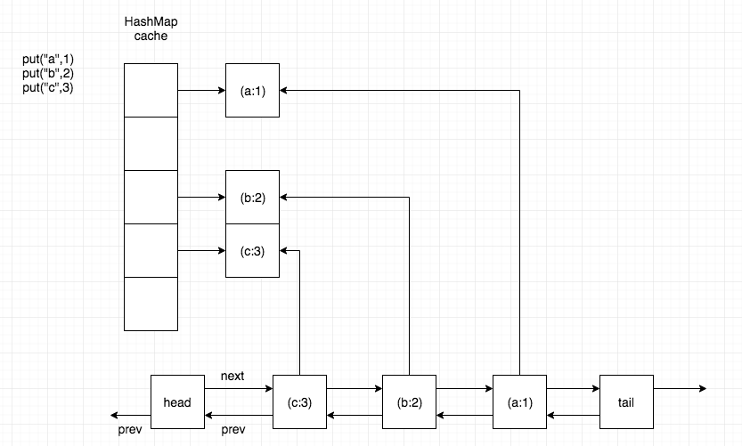
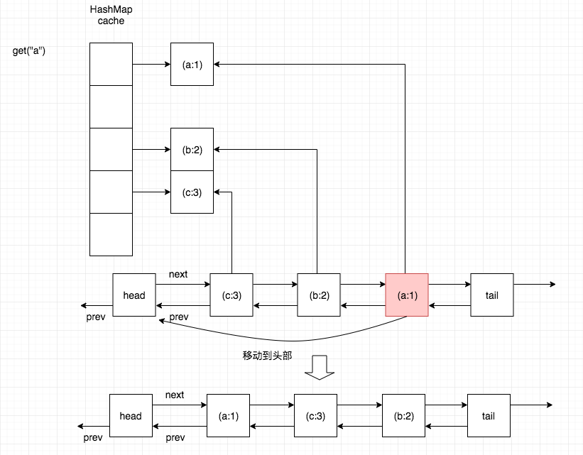
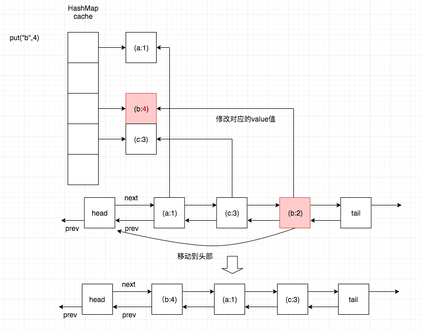
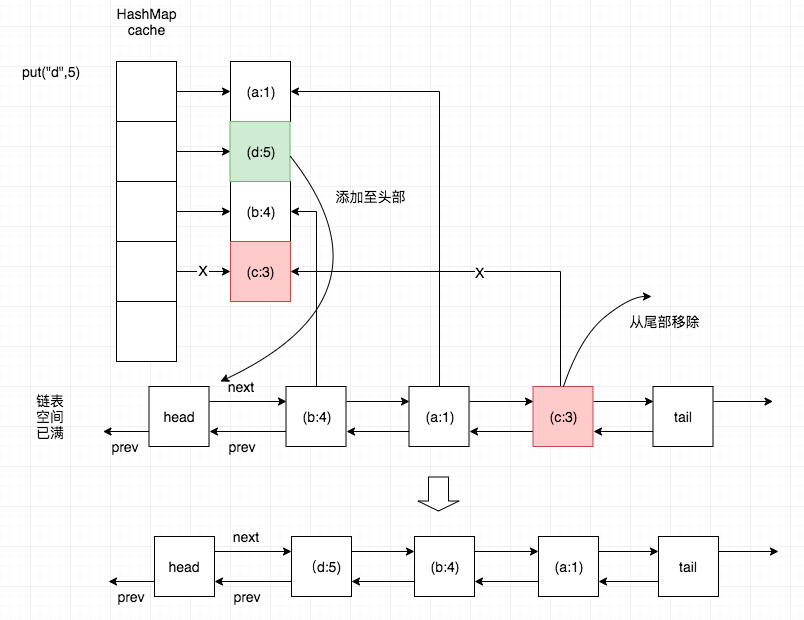

# 缓存淘汰算法 LRU

[TOC]

## LRU概述

LRU（Least Recently Used）翻译过来就是“最近最少使用”，是缓存淘汰算法中的一种，算法思想是把缓存中最近最少使用的数据清除，让给最新读取的数据。

## LRU实现

算法思路：

* 缓存数据直接用HashMap来保存可以保证读取数据的时间复杂度为O(1)
* 数据被访问或者更新过后都需要更新其位置
* 新来的数据进入头部，缓存已满需要删除尾部（最早进入）的数据 （FIFO 队列）

基于以上思路，可以想到设计的LRU缓存需要一个HashMap来储存数据，一个链表来满足排序需求。

因此，要实现LRU缓存，需要满足：

1. 新来的数据添加到缓存链表的头部（最新数据）
2. 缓存中的数据被访问（即缓存命中），则将数据移到链表的头部
3. 当缓存空间已满，需要将链表尾部的数据淘汰（最老数据）

以下为代码：

```java
public class LRUMap<K, V> {

    private class Node<K, V> {
        private K key;
        private V value;
        Node<K, V> prev, next;

        public Node() {
        }

        public Node(K key, V value) {
            this.key = key;
            this.value = value;
        }

        public K getKey() {
            return key;
        }

        public void setKey(K key) {
            this.key = key;
        }

        public V getValue() {
            return value;
        }

        public void setValue(V value) {
            this.value = value;
        }
    }

    private final Map<K, Node> cacheMap = new HashMap<>();
    /** max size of cache **/
    private int capacity = 0;
    private Node<K, V>  head;
    private Node<K, V> tail;

    /**
     * 初始化LRU Cache
     * @param capacity
     */
    public LRUMap(int capacity) {
        this.capacity = capacity;
        head = new Node<>();
        tail = new Node<>();
        head.next = tail;
        tail.prev = head;
    }

    /**
     * 访问数据
     * @param key
     * @return
     */
    public V get(K key) {
        if (!cacheMap.containsKey(key)) {
            //如果HashMap中不存在key，则返回空
            return null;
        }
        //缓存命中，先从链表中删除该节点，然后添至头部
        Node<K, V> currentNode = cacheMap.get(key);
        removeNode(currentNode);
        addToHead(currentNode);
        return currentNode.getValue();
    }

    /**
     * 更新或添加数据
     * @param key
     * @param value
     */
    public void put(K key, V value) {
        if (get(key) != null) {
            //缓存命中，更新数据
            cacheMap.get(key).setValue(value);
            return;
        }
        if (cacheMap.size() >= capacity) {
            //缓存空间已满，删除尾部节点（最老数据）同时从HashMap中删除该数据
            cacheMap.remove(tail.prev.key);
            removeNode(tail.prev);
        }
        //缓存没有命中，添加新数据至HashMap中，添加新节点到头部
        Node<K, V> newNode = new Node<>(key, value);
        cacheMap.put(key, newNode);
        addToHead(newNode);
    }

    /**
     * 删除节点
     * @param node
     */
    private void removeNode(Node node) {
        node.prev.next = node.next;
        node.next.prev = node.prev;
    }

    /**
     * 添加节点至头部
     * @param node
     */
    private void addToHead(Node node) {
        node.next = head.next;
        node.next.prev = node;
        node.prev = head;
        head.next = node;

    }

    @Override
    public String toString() {
        StringBuilder sb = new StringBuilder();
        sb.append("LRUMap{(head)->");
        Node<K, V> node = head.next;
        while (node != null && node.key != null) {
            sb.append("(").append(node.getKey()).append(":").append(node.getValue()).append(")->");
            node = node.next;
        }
        sb.append("(tail)}");
        return sb.toString();
    }
}
```

通过测试代码来测试：

```java
@Test
public void void testLRUCache {
    LRUMap<String, Integer> lruMap = new LRUMap<>(3);
    lruMap.put("a", 1);
    lruMap.put("b", 2);
    lruMap.put("c", 3);
    System.out.println(lruMap); //LRUMap{(head)->(c:3)->(b:2)->(a:1)->(tail)}
    lruMap.get("a");
    System.out.println(lruMap); //LRUMap{(head)->(a:1)->(c:3)->(b:2)->(tail)}
    lruMap.put("b", 4);
    System.out.println(lruMap); //LRUMap{(head)->(b:4)->(a:1)->(c:3)->(tail)}
    lruMap.put("d", 5);
    System.out.println(lruMap); //LRUMap{(head)->(d:5)->(b:4)->(a:1)->(tail)}
}
```

初始化后：


添加节点`("a",1) ("b",2) ("c",3)`后：



访问a节点，缓存命中，移动a节点至头部：



更新节点b，缓存命中，更新b节点value值然后移动到链表头部：



更新节点d，缓存不存在，添加新元素至HashMap表，清除最老数据节点（缓存已满）然后将新节点添加到头部：



## 其他思路

除了以上实现方法外，还可以参看[LinkedHashMap源码分析](https://github.com/yankuangshi/md/tree/master/lhm)，可通过扩展LinkedHashMap来实现LRU缓存。